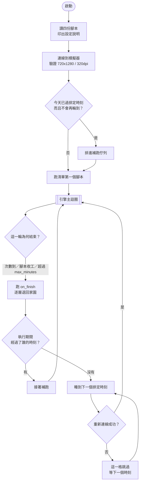
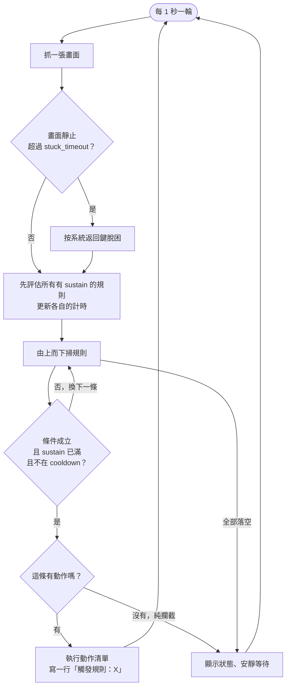
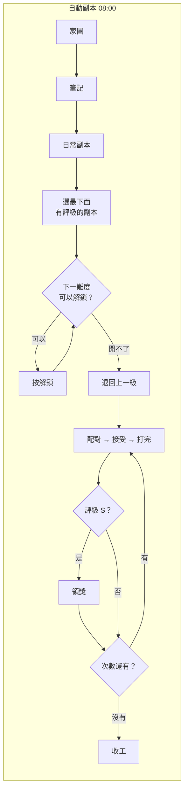
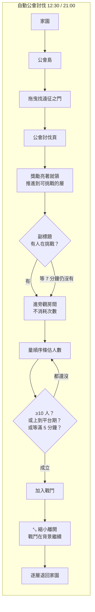
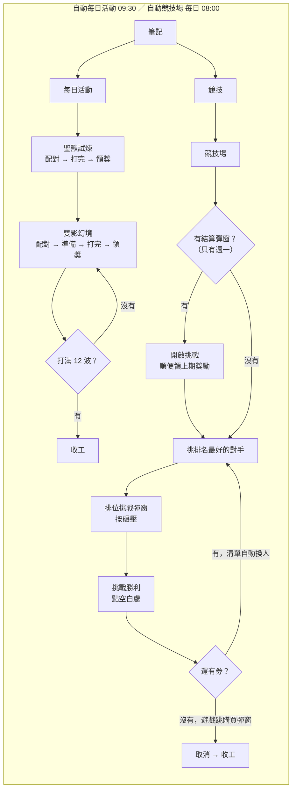

# 杖劍傳說助手

透過 ADB 操作 Android 模擬器的自動化助手。全程走 ADB 指令，屬於**後台操作**——
不會搶佔實體滑鼠鍵盤，模擬器視窗最小化也照常運作。

目前實作了五份腳本：

- **自動副本**（`dungeon`）——從任意畫面出發，自己走到日常副本、配對、打完、
  判斷評級、只在 S 級時領獎，次數用盡就收工。新副本開放時會依畫面上的條件列
  一級一級解鎖難度，開不動了才開始領獎。
- **自動公會討伐**（`raid`）——走到公會島的遠征之門，領走討伐獎勵、推進到可挑戰的
  樓層，進旁觀房間量人數，等人夠多才加入戰鬥，等不到人就自己先進去觸發。
- **自動每日活動**（`daily`）——聖獸試煉打一場領獎；雙影幻境刷到滿波（12 波），
  沒推到就再開一場，最多打幾場由 `repeat` 決定。這兩個活動不消耗每日次數，
  只記當日最佳成績。
- **自動競技場**（`arena`）——每天把累積的競技場券用掉。入場鍵有兩種：戰力遠高於
  對手時是「碾壓」，直接判贏；戰力相近時是「挑戰」，會真的進戰鬥，腳本按下開始後
  用快進鍵跳到結果。打輸了可以自動換下一個對手再試。每週一還會順便按下「開啟挑戰」
  開新一期並領走上一期的排名獎勵。
- **自動日常雜務**（`chores`）——每天要做、但各自只有幾步的小事合成一趟走完：
  領命運果實、跑羈絆冒險（領獎並派人）、公會捐獻。三段各自有開關。

兩種操作方式，底下是同一套引擎、同一份設定檔：

- **圖形介面**——不帶參數執行（雙擊 EXE，或 `python main.py`）就會開啟視窗。
  勾開關、填每日時間、按下開始，過程即時顯示在日誌面板；執行中可以縮到系統匣掛著跑。
- **命令列**——`python main.py run`。錄製、裁模板、驗規則那些開發工具只有這邊有。

## 整體流程

三層：**排程**決定什麼時候跑哪一份腳本，**引擎**每秒看一次畫面決定做什麼，
**腳本**用 YAML 描述「看到什麼就做什麼」。三層之間只透過設定檔與規則表溝通。



引擎的一輪（`core/engine.py`）——**不記錄「走到第幾步」**，所以從戰鬥中、
結算頁、甚至誤點進去的子頁面啟動都能自己走回正軌：



規則的**順序就是優先度**，由上而下大致是：

| 層 | 例子 | 為什麼排這裡 |
|---|---|---|
| 限時操作 | 配對成功 → 接受（只有 20 秒） | 錯過就要重配 |
| 主流程 | 詳情頁 → 配對、結算 S → 領獎 | 正常路徑 |
| 純攔截 | 配對中、戰鬥中、等人中（`do: []`） | 擋住兜底，讓引擎安靜等 |
| 兜底 | 誤入次要頁面 → 點返回、完全無法辨識 → 系統返回鍵 | 都設 `sustain`，避免轉場誤動作 |

四份腳本各自要走的路：







## 環境

| 項目 | 版本 |
|---|---|
| Python | 3.14 |
| 模擬器 | 任何開得了 ADB 的 Android 模擬器，解析度 **720x1280**、DPI **320** |
| 遊戲 | 杖劍傳說（`com.m88.idleXX`），介面語言**繁體中文** |

解析度務必維持 720x1280，模板是依這個尺寸裁的。語言也要維持繁體，
含文字的模板換語系就會失效（詳見下方「製作模板」）。

**模擬器沒有綁定哪一家。** 程式只用標準的 `adb` 指令（截圖、點擊、滑動、啟動 App），
任何開得了 ADB 又調得到 720x1280／320dpi 的模擬器都適用。要設定的只有兩件事：
在模擬器裡打開「允許遠端 ADB 連線」，以及查出它用的 **ADB 連接埠**。

## 安裝

**用打包好的 EXE**（一般使用者走這條）：到
[Releases](https://github.com/LaiYueTing/scepter-and-sword-assistant/releases/latest)
下載 `ScepterSwordAssistant.exe`，只需要這一個檔案——腳本、模板、adb 全都在裡面。
放在一個固定的資料夾（它會在旁邊產生設定檔與紀錄），第一次執行會自動產生
`config.yaml` 然後停下來，填入模擬器的 IP 與連接埠再執行一次即可。

檔名可以隨意改（想改成「杖劍傳說助手.exe」也行），程式與自動更新都是認自己的
實際路徑，不看檔名。⚠ 附件用英文檔名是因為 GitHub 的附件名稱不收非 ASCII 字元，
中文名會被換成 `default.exe`。

**從原始碼跑**：

```bash
pip install -r requirements.txt
python main.py               # 圖形介面
python main.py doctor        # 命令列
```

原始碼版本**不含 `platform-tools/`**（那是 Google 的 adb，體積大而且各平台不同）。
自行從 [Android SDK Platform Tools](https://developer.android.com/tools/releases/platform-tools)
下載解壓到專案底下的 `platform-tools/`，或把設定檔的 `adb.path` 指向系統已有的 adb。

### 自動更新

圖形介面的標題列有一顆「檢查更新」，開啟視窗時也會自己安靜查一次（查不到就不出聲）。
有新版時那顆按鈕會變成「更新到 vX.Y.Z」，按下去會下載並就地換掉執行檔，
問你要不要立刻重新啟動。

⚠ **執行中不會更新。** 換檔要重新啟動才生效，而重新啟動會中斷正在跑的副本或討伐，
那一次次數不會回來——所以按下去只會提醒你先停止。

⚠ 更新是「把 EXE 換掉」而已，`config.yaml`、`logs/`、`state.json`、`ui.json`
都不會被動到。
舊版會暫時留成 `<原本的檔名>.exe.old`，下次啟動時自動刪掉。

沒有視窗的話（用工作排程器跑 `run` 的人）可以用命令列：

```
杖劍傳說助手.exe update --check      # 只看有沒有新版
杖劍傳說助手.exe update --restart    # 裝完直接重新啟動
```

⚠ 不要把 `update` 排進自動流程。它會換掉執行檔並要求重新啟動，
而排程醒來的時候往往正要去打副本。

### 自行打包

```bash
python tools/make_splash.py   # 產生啟動畫面（第一次或換過底圖時才要跑）
build.bat                 # 產出 dist\杖劍傳說助手.exe（單一執行檔）
```

雙擊到視窗出現約六秒，其中三秒多是解壓 EXE，所以會先顯示一張帶進度條的啟動畫面。

那張圖是 `assets/splash.png`，由 `tools/make_splash.py` 產生。**版本控制裡沒有底圖**——
原本用的是遊戲自己的載入插畫，不隨原始碼轉發，所以沒有 `loading.png` 時那支工具會
改畫一張純色漸層底，一樣編譯得出來。想換成自己的圖就放一張 `loading.png` 進 `assets/`
再跑一次；換圖若連尺寸也改了，它會把 `杖劍傳說助手.spec` 該更新的 `text_pos`
印出來（進度文字的座標跟著版面走）。

⚠ 打包走的是 `杖劍傳說助手.spec` 而不是一串命令列參數，因為**進度條只有 .spec
才做得到**：命令列的 `--splash` 產生的設定是 `text_pos=None`，那會關掉動態文字。

想改腳本或換掉某個模板而不重新編譯，可以在 EXE 旁邊放 `scripts\` 或 `templates\`，
**同名檔案會覆蓋內建的那份**。是逐檔覆蓋，所以只放你要改的那一個就好，
其餘照用 EXE 內建的。

## 連線設定

第一次執行會在程式旁邊產生 `config.yaml` 然後**停下來**，讓你先填好要連哪一台
模擬器，填完再執行一次即可。

**最省事的方式是讓它自己找**：圖形介面的模擬器區塊按「探索」，或命令列跑
`python main.py devices`。兩邊都會掃本機與設定檔裡的 IP，列出看得到的模擬器
（含型號與解析度）；介面上從下拉選一台就把序號／IP／連接埠一起填好。

```
序號                       狀態         解析度            型號
192.168.1.108:16480      device     720x1280/320   SM-S938U
```

⚠ **解析度一定要是 720x1280、320 dpi**。所有模板都依這個尺寸裁，尺寸不對時
連線會成功、但每一條規則都比不中——那比連不上更難查，因為紀錄只會顯示
「沒有規則成立」。清單上不符的會標出來。

要手動填的話：

**同一台電腦**：`device.serial` 填 `auto` 即可（範本預設就是），會自動抓
唯一連線中的裝置。多開時用 `devices` 查序號，再填例如 `emulator-5556`。

**從別台電腦連過去**（助手在虛擬機、模擬器在實體機）：

1. 在模擬器的設定裡把 ADB 連線改成**允許遠端連線**
   （只綁 127.0.0.1 的話，外部一律連不進來）
2. 抄下它顯示的 **ADB 連接埠**，填進 `port`
3. 防火牆放行該連接埠
4. `host` 填模擬器所在電腦的 IP，`serial` 留空

各家模擬器的選單名稱不同，但要找的就是這兩件事。**找不到埠號也沒關係**——
「探索」會掃常見的那幾個（16384 起跳的多開埠、62001、5555／21503、7555），
連得上就會列出來。

設定完跑 `python main.py doctor` 驗證。

## 指令

```bash
python main.py                           # 開啟圖形介面（EXE 不帶參數雙擊也是這個）
python main.py doctor                    # 檢查環境與連線
python main.py update [--check] [--restart]      # 檢查並安裝新版
python main.py devices                   # 探索可用裝置（會掃常見的模擬器連接埠）
python main.py devices --no-scan         # 只列已連上的，不主動掃描
python main.py run                       # 依排程輪流執行啟用的腳本
python main.py run -t raid               # 只跑指定腳本一輪就結束（手動補跑用）
python main.py run -n 5 --once           # 跑 5 次，忽略每日排程
python main.py run --dry-run             # 只判斷不點擊，安全驗證流程
python main.py explain                   # 說明當前畫面會觸發哪條規則
python main.py selftest                  # 用 samples/ 驗證規則沒被改壞（預設驗全部腳本）
python tests/test_confedit.py            # 驗設定檔的就地改值沒壞（selftest 涵蓋不到）
python tests/test_schedule.py            # 驗排程與補跑的分岔
python tests/test_arena_retry.py         # 驗競技場「輸了換對手」的跨畫面計數
python main.py clean [--yes]             # 清掉截圖與錄製（samples/ 會保留）
python main.py shot 名稱                  # 抓一張截圖
python main.py record 名稱 -d 480         # 錄製流程，抽關鍵幀並拼總覽圖
python main.py sheet 名稱 --start 0 --count 48   # 重做總覽圖，可分批逐張看
python main.py scan 名稱 模板 [--absent]   # 掃描整段錄製，找出現/沒出現該模板的幀
python main.py crop 截圖 x y w h 模板名     # 從截圖裁模板
python main.py find 模板名 [--source 截圖]  # 測比對分數
python main.py tap x y                   # 手動點擊，驗證座標
```

`crop` / `find --source` 的截圖名稱可以直接用錄製的幀名（如 `86_0074.5s`），
會自動到 `logs/records/` 底下找。

## 設定檔

**每個區段都可以整段刪掉**，刪掉就用預設值。唯一一定要設定的是「連哪一台模擬器」。

### 要跑哪些腳本

`tasks` 底下每個腳本**各自開關、各自排時間**，所以可以同時啟用：

```yaml
tasks:
  - name: dungeon              # 自動副本
    enabled: true
    daily_at: "08:00"          # 次數每天早上 08:00 重置
    repeat: 0                  # 0 = 不限次數，打到腳本自己的收工條件

  - name: raid                 # 自動公會討伐
    enabled: true
    daily_at: ["12:30", "21:00"]   # 可以給一個時間，也可以給一串
    repeat: 1                      # 一輪就是打一場

  - name: daily                # 自動每日活動
    enabled: true
    daily_at: "09:30"          # 排在副本跑完、離討伐還很遠的閒置時段
    repeat: 3                  # 雙影幻境最多打幾場（推到 12 波就提早收工）

  - name: arena                # 自動競技場
    enabled: true
    daily_at: "08:00"          # 每天把券用掉（券每 5 小時回一張，上限 20）
    weekly_at: "週一 08:00"     # 新一期在週一開始，早點按排名較前面
    repeat: 1
```

`daily_at` 與 `weekly_at` 可以並用。`weekly_at` 寫成「星期 時間」，星期收中英與
簡寫（`週一`／`一`／`Mon`）。

`repeat` 在每份腳本的意思不同，因為「一輪」的定義不同：副本是打幾場、討伐是入場
幾次、每日活動是**雙影幻境最多開幾場**（聖獸試煉打一場就遠超所有獎勵門檻，
不列入計次）。

執行 `run` 之後的行為：**啟動時先跑清單裡第一個啟用的腳本**（不必等到排定時刻，
不然半夜開就得乾等到早上），跑完之後在啟用的腳本裡找「最近的下一個排定時刻」，
睡到那時候再跑對應的腳本。照上面的設定，從早上七點啟動會是：

```
08:00 dungeon → 09:30 daily → 12:30 raid → 21:00 raid → 隔天 08:00 dungeon → ...
（週一還會多一個 08:00 arena）
```

**錯過的時刻會補跑**（`runtime.catch_up`，預設開）。兩種情況：晚上才開程式時，
今天已過而且不會再輪到的腳本會接在第一輪後面跑；某個腳本執行期間經過了別人的
時刻，也會在它跑完之後補上。⚠ 今天還有下一格的不補跑——那只是把有限次數提早用掉。

啟動時多跑一輪是安全的：每份腳本都判斷得出「今天做完了」（副本與討伐看次數，
每日活動看當日成績），就算今天已經跑過，重跑也只是很快確認一下就結束。

排時間時要讓每份腳本跑得完再換下一個——排程是一輪跑完才找下一個時刻，所以
**前一個超時會把後面的往後推**。上面的間隔留得很寬：每日活動最壞（雙影連打 3 場）
約 40 分鐘，離 12:30 的討伐還有兩個多小時。

`daily_at` 留空 `[]` 表示不排程（跑完就結束）。想手動只跑一個，用 `run -t raid`。

**補跑會讓路給快到的排定時刻。** 晚上才開程式時，今天已過的那幾格會被補跑
（`runtime.catch_up`），但如果下一個排定時刻就在 30 分鐘內
（`runtime.catch_up_guard_minutes`），補跑會先等它跑完再開始——公會討伐 21:00
的價值就在那時候人最多，被補跑輾過去就白等了。設 0 可以關掉這個讓路。

### 購買領獎次數

`buy_counts` 決定領獎次數用完時自動買幾次（遊戲每日限購 2 次）：

```yaml
options:
  buy_counts: 1      # 1 = 只買 1 次（預設）；2 = 一次買滿上限
```

設 2 時腳本會在購買彈窗上先把數量加到上限再確認。

### 腳本開關

`options` 是所有腳本共用的開關，規則用 `when_option` 綁定，同一份腳本就能適應
不同玩法。用不到的開關留著不會有影響。

| 開關 | 腳本 | 說明 |
|---|---|---|
| `claim_reward` | dungeon | 評級 S 就領獎。設 false 則打完直接退出，不消耗領獎次數 |
| `stop_when_no_count` | dungeon | 次數用盡又買不到就收工。設 false 則繼續打（刷友情點數） |
| `auto_battle_mode` | dungeon | 進戰鬥後自動開啟遊戲內的「自動模式」 |
| `like_teammates` | dungeon | 結算頁順手幫隊友按讚 |
| `claim_raid_reward` | raid | 討伐獎勵亮著就先領走，再往下一關 |
| `wait_for_others` | raid | 等場上有人開打才入場。設 false 則一到可挑戰的層就直接進 |
| `claim_daily_reward` | daily | 打完把獎勵條上亮起來的獎勵領走（兩個活動共用） |
| `accept_with_partners` | dungeon | 配對湊了 NPC 夥伴也照樣接受。設 false 會等真人隊伍 |
| `crush_arena` | arena | 把競技場券用掉（打排位）。關掉的話只在週一按「開啟挑戰」 |
| `arena_opponent` | arena | 挑第幾個對手（1～4，由左到右）。1 最強、爬得最快；4 必定碾壓 |
| `arena_max_battles` | arena | 每天最多打幾場。**跨執行保留**，補跑不會重新計數 |
| `arena_retry_on_loss` | arena | 打輸了改挑排名低一階的再試，連輸三場就收工 |
| `buy_arena_tickets` | arena | 券用完時用晨星補買。⚠ 會花資源，**必須明寫 `true`** 才生效 |
| `chores_fruit` | chores | 領命運果實（地圖探索頁的卡片亮出「可領取」就點掉） |
| `chores_bond` | chores | 跑羈絆冒險（有紅色驚嘆號的節點就進去領獎或派人） |
| `chores_donate` | chores | 做公會捐獻。關掉的話走向公會的每一步都不動作 |
| `guild_donate_free` | chores | 公會捐獻的免費那一次 |
| `guild_donate_stars` | chores | 免費之後用晨星繼續捐。⚠ 會花資源 |
| `guild_donate_star_times` | chores | 免費之後最多再花晨星捐幾次（0～4，每天共 5 次）。**跨執行保留** |

`chores_fruit` / `chores_bond` / `chores_donate` 三段各自獨立，關掉的那一段整個
不會走進去；三段都關掉就直接收工。順序固定是命運果實 → 羈絆冒險 → 公會捐獻。

公會討伐的等人策略另外有六個數值開關（`raid_join_players` 估到幾人就入場、
`raid_join_wait_minutes` 保底等幾分鐘、`raid_plateau_players` / `raid_plateau_sustain`
人數上到平台期就入場等），每一個在 `config.example.yaml` 裡都有註解說明為什麼是
那個預設值。

圖形介面上這些開關在左欄的「玩法設定 ...」裡，一份腳本一個分頁；數值型的直接
用輸入框改，改完立刻寫回設定檔（會保留原本的註解）。

**「跨執行保留」是什麼意思。** `arena_max_battles` 與 `guild_donate_star_times`
這種「每天最多幾次」的上限記在程式旁邊的 `state.json`，補跑或手動再跑一次都不會
重新計數，換一天自動歸零。其餘的上限都是**每輪**重置的。

⚠ 這是刻意的例外。引擎的原則是「不記錄今天做過沒，因為腳本會進遊戲自己確認」——
而那條的前提是**答案寫在畫面上**。「今天打過幾場競技場」「捐了幾次」遊戲沒有顯示，
前提不成立，才需要自己記。

## 執行時看到什麼

開頭會先列出這次是用什麼設定在跑，出問題回頭看這幾行通常就知道方向：

```
[2026-08-10 03:03:07] [資訊] [主程式] ═══ 杖劍傳說助手 v1.0.0 ═══
[2026-08-10 03:03:07] [資訊] [主程式] 目標裝置：192.168.1.108:16480（預期 720x1280、320 dpi）
[2026-08-10 03:03:07] [資訊] [主程式] 執行方式：依排程輪流執行，啟動時先跑「dungeon」
[2026-08-10 03:03:07] [資訊] [引擎]   觸發規則：副本詳情頁 → 確認副本後配對
[2026-08-10 03:03:07] [等待] [引擎]   配對中　1 分 08 秒
```

配對中、戰鬥中這類等待狀態會**固定在同一行原地更新**經過時間，不會把畫面刷滿。
紀錄檔 `logs/assistant.log` 只留心跳（5 分鐘一行）與「這段等了多久」的總結。
**每天換一個檔**：當天的叫 `assistant.log`，跨過午夜就改名成
`assistant-2026-08-23.log`，保留 30 天。

圖形介面的日誌面板顯示的是同一份紀錄，等待狀態改在底部狀態列即時更新（「旁觀房間　2 分 30 秒」）。
按下「停止」之後不會立刻結束——**收尾動作照常跑完**，把畫面一層層退回家園再停，
所以會看到「停止中，正在執行收尾動作 ...」約十秒。

## 摸清流程的作法

要自動化一段流程，得先知道它有哪些畫面。逐張截圖太慢，用 `record`：

```bash
python main.py record battle -d 480 -t 7 -m 36 --cols 6
```

它連續抓幀，**只保留畫面真正變化的那幾張**（`-t` 是變化門檻，戰鬥特效多
就調高），最後拼成一張總覽圖，一次看完整段流程。錄製是邊錄邊存的，
中途中斷也不會丟資料，事後用 `sheet` 補做總覽圖。

總覽圖會抽樣，只出現一兩秒的提示可能被濾掉。要逐張看完就分批：

```bash
python main.py sheet battle --start 0 --count 48 --cols 8
python main.py sheet battle --start 48 --count 48 --cols 8
```

要在幾百張幀裡找特定畫面，用 `scan` 比翻總覽圖快得多：

```bash
python main.py scan battle btn_settings_gear            # 哪幾張有齒輪
python main.py scan battle btn_settings_gear --absent   # 反過來，找非戰鬥畫面
```

## 製作模板

1. `python main.py shot 畫面名` 抓下當前畫面
2. 開圖確認目標區塊座標
3. `python main.py crop 畫面名 x y w h 模板名` 裁出來
4. `python main.py find 模板名` 確認分數，1.000 最理想，低於 0.85 要重裁

**裁模板的三個原則**（實測踩過的坑）：

- **避開文字**——比對是純像素層級。實測同一顆按鈕，簡體模板對繁體畫面
  只有 **0.772**，繁體模板 **1.000**，差距足以讓規則整條失效。優先選圖示、
  按鈕圖案這類與語系無關的元素（`card_daily_dungeon` 的漩渦、`nav_home`
  的房子圖示在簡繁介面都是 1.000）。
- **避開紅點與數字徽章**——通知驚嘆號、剩餘次數這些會變。
- **避開會動的東西**——裁完連測幾次確認穩定。半透明按鈕疊在戰鬥特效上，
  分數會從 1.000 掉到 0.4。這種元素還要**量出分數的實際分佈**再決定門檻：
  副本戰鬥的左側齒輪，132 張戰鬥幀的分數落在 0.863～0.913、準備階段只有 0.792，
  用預設的 0.85 會有一大部分落空。

**`region` 要留餘裕，別貼齊邊界。** 畫面上多一行提示文字，就可能把下方的元素
整個推移。實測配對成功時若湊了 NPC 夥伴，多出的兩行紅字把「接受」按鈕往下推 75px，
而 region 只差 7 個像素沒涵蓋到——模板全畫面 0.974、限定 region 只有 0.369，
規則整條落空，變成「一直配不到人」（其實是配到了沒按接受）。

**務必做反向驗證**：不只確認「該中的有中」，也要確認「不該中的沒中」。
例如 `rank_s` 在 S 級結算頁 **0.999**、A 級 **0.386**，這個差距才是
「只在 S 級領獎」能成立的基礎。

## 撰寫腳本

腳本放在 `scripts/*.yaml`，是「看到什麼就做什麼」的規則表，不是寫死的
固定步驟。引擎每輪抓一張畫面，由上而下檢查，執行**第一條成立**的規則。

這個設計有幾個好處值得說明：

- **順序就是優先度**。限時操作（配對成功只有 20 秒能按接受）排最前面，
  兜底排最後。
- **不必為「等待」寫規則**。配對中、戰鬥中、準備倒數、選房間這些狀態，
  因為沒有任何規則成立，引擎自然就是靜靜等下去。等 20 秒或 3 分鐘都一樣，
  比寫死「點完配對等 60 秒」穩健得多。
- **從任何狀態啟動都能接上**。腳本不記錄「我走到第幾步」，每輪重新看畫面
  決定動作。所以從戰鬥中、結算頁、甚至誤點進去的子頁面啟動，都能自己走回正軌。

### 規則欄位

| 欄位 | 說明 |
|---|---|
| `name` | 規則名稱，只用於記錄 |
| `template` | 要找的模板，可給一個或一串（任一符合即觸發） |
| `absent` | 反向條件：全都找不到時才觸發 |
| `require` | 額外前置條件，這些模板必須全部存在（全畫面搜尋，不受 region 限制） |
| `measure` | 量某個顏色在指定區域裡佔了多少寬度（見下） |
| `threshold` | 比對門檻，省略則用 config 預設 |
| `region` | 限定搜尋範圍 `[x, y, w, h]`，可加速也可避免誤判 |
| `pick` | 有多個匹配時挑哪個：`best`（預設）/`lowest`/`highest`/`first`/`last`，或直接給數字＝由左數來第幾個 |
| `sustain` / `sustain_minutes` | 條件必須**連續成立**幾秒／幾分鐘才觸發 |
| `cooldown` | 觸發後幾秒內不再觸發 |
| `once` / `max_fires` | 只觸發一次 / 最多觸發幾次（每輪重置） |
| `max_fires_daily` | 每天最多觸發幾次，**跨執行保留**（記在 `state.json`，換日歸零） |
| `when_option` | 綁定 config 的設定。`like_teammates` 要它為 true、`!claim_reward` 要它為 false、`buy_counts=2` 要它等於某個值 |
| `do` | 動作清單。留空表示「純攔截」——只擋住後面的規則，什麼都不做 |

`template` 和 `absent` **不能併用**（有 template 時 absent 會被忽略）。要表達
「有 A 而且沒有 B」，寫成 `require: [A]` 搭 `absent: [B]`，動作改用 `tap_template`。

#### `${設定名:預設值}`：讓門檻可以在設定檔裡改

規則的**任何欄位**都可以寫成 `"${raid_join_players:10}"`——設定檔有那個鍵就用設定值，
沒有就用冒號後面的預設。使用者因此不必為了改「等到幾人才入場」去動腳本。

```yaml
measure:
  at_least_players: "${raid_join_players:10}"   # 填人數，引擎換算成順序條的單位數
sustain_minutes: "${raid_join_wait_minutes:5}"  # 填分鐘，比填 300 秒清楚
max_fires_daily: "${arena_max_battles:20}"
```

⚠ **一定要帶預設值。** 少了的話，還沒有那個鍵的舊 `config.yaml` 一升級就直接載入
失敗，而使用者根本沒改過任何東西。

⚠ 只認「整個字串就是一個變數」，不做字串內嵌——那是為了保留型別：代出來的 20
必須是數字而不是 `"20"`。

搭配的兩個轉換都是為了讓設定檔用人話表達：`at_least_players` 填的是人數（引擎
照校準過的換算式換成內部的單位數），`sustain_minutes` 填的是分鐘。

#### `measure`：量長度而不是認圖案

有些狀態不是「畫面上有沒有某個圖案」，而是「某條東西有多長」——公會討伐的順序條、
血條都是。這種元素裁模板會裁到會變的內容（別人的角色、寵物），改量固定的 UI 顏色：

```yaml
measure:
  region: [70, 119, 572, 18]   # 要量的區域
  metric: units                # span（預設）量顏色寬度；units 估排了幾個單位
  color: [80, 143, 141]        # 要量的顏色（BGR）
  tol: 22                      # 容許誤差，預設 22
  smooth: 15                   # 取最近 15 次讀數的中位數（估計值必用）
  at_least: 28                 # 要 ≥ 28 才成立（也可用 at_most）
  log: 順序條單位數             # 取個名字，引擎會每 30 秒把數值寫進紀錄
```

`metric: span` 量的是「某個顏色橫向佔了幾 px」，適合長度會變的條狀元素。
`metric: units` 是給「等距重複的圖示列」用的：它會扣掉沒排到的部分、再用自相關
求圖示間距，算出大概排了幾個單位——**因為圖示多到擠不下時會自動縮小，
單純量長度會飽和**。這是估計值，所以一定要配 `smooth` 與 `sustain`。

`log` 是調門檻的關鍵：跑幾場之後紀錄裡就有真實數字，不必憑感覺猜。
`measure` 可以和 `require`、`sustain` 一起用，各條件是 AND 的關係。

### 動作

| 動作 | 說明 |
|---|---|
| `tap_match: [dx, dy]` | 點擊剛比對到的位置，可給偏移；`[]` 表示不偏移 |
| `tap: [x, y]` | 點擊固定座標 |
| `tap_template: 名稱` | 當場尋找並點擊某個模板 |
| `tap_all: 名稱` | 點掉畫面上所有符合的目標（例如每位隊友的按讚鈕） |
| `swipe: [x1,y1,x2,y2,ms]` | 滑動 |
| `back:` | 送出系統返回鍵 |
| `wait: 2.5` | 等待秒數 |
| `wait_for: [模板, ...]` | 等到其中一個模板出現才往下走（最多 25 秒，逾時就放行）|
| `count:` | 完成次數 +1，達到 `repeat` 就停止 |
| `screenshot: 名稱` | 存除錯截圖 |
| `log: 訊息` / `finish:` | 寫紀錄 / 結束腳本 |
| `restart_app:` | 關掉遊戲再開起來（脫困的最後手段，約 152 秒回到家園） |
| `log_match: {欄位: {region, of}}` | 把「畫面上是哪一種」寫進紀錄（評級 S／A／B） |
| `log_text: {欄位: 區域}` | 用系統內建 OCR 讀文字寫進紀錄（見下） |
| `reset_fires: [規則名, ...]` | 把那幾條規則的 `max_fires` 計數歸零，讓它們可以再觸發（見下） |

`wait_for` 是給 `on_finish` 用的。那份清單是無條件執行的，沒有規則可以「等某個
畫面出現」，而換頁前後常有幾秒的載入——固定的 `wait:` 只能猜，猜短了整串動作全部
空點，猜長了每次收尾都白等。

`max_fires` 是引擎唯一的「這一輪發生過什麼」的記憶，而 `reset_fires` 讓那份記憶可以
清掉——用來表達「條件變了，重來一次」。競技場就是這樣做到「打輸了換下一個對手，
贏了回到第一順位」的：三條挑對手的規則各 `max_fires: 1` 依序接力，勝利那條把它們
歸零。

⚠ 參數是**規則名稱**，打錯的話執行時什麼都不會發生。所以載入腳本時就會檢查名稱
存不存在，對不上直接報錯。

```yaml
- name: 挑戰勝利 → 點空白處關閉
  template: label_arena_win
  do:
    - reset_fires: [競技場頁 → 挑對手, 上一場輸了 → 改挑弱一點的對手]
    - tap: [360, 640]
```

`log_text` 讀的是**內容會一直增加**的欄位——副本名稱、難度那種。用模板的話每出一個
新副本就要補一張圖，而且只認得補過的；讀文字就沒這個問題，也不必安裝任何東西
（走 Windows 內建的 OCR）。

```yaml
- log_text:
    副本: {region: [110, 174, 510, 64], binary: 210, scale: 3, trim_right: 193}
    難度: {region: [30, 798, 170, 34], scale: 4, strip: 副本獎勵}
```

| 參數 | 用途 |
|---|---|
| `scale` | 放大倍率。**一定要放大**，原尺寸的字太小讀不出來（實測 x2 讀錯、x4 才對） |
| `binary` | 亮度門檻，會先轉成黑字白底。白色美術字疊在場景圖上時非這樣不可 |
| `trim_right` | 找到文字右端後往左扣掉幾 px，用來切掉讀不好的那半段 |
| `strip` | 去掉固定的贅字（例如「副本獎勵」） |

參數不要猜，用 `python main.py text <截圖> x y w h --binary N --scale N` 先試。
`log_text` 只用來寫紀錄，不要拿去做判斷：每次要開一個 PowerShell（約 1 秒），
而且美術字讀不穩。

模板還沒做好的規則會被自動停用並留下警告，不會讓整個腳本崩潰，
所以可以先寫規則、之後再補模板。

### 除錯

規則不如預期時，`explain` 會把每條規則的判斷結果攤開：

```
  -      副本詳情頁 → 確認副本後配對                  template=0.54
→ 觸發     誤入次要頁面 → 點返回退出               template=1.00
結論：會執行「誤入次要頁面 → 點返回退出」
```

一眼看得出是「順序排錯」還是「模板認不出來」——這兩個是最常見的坑。

## 實測踩過的坑

這些都是實機跑出來的，靜態檢查看不出來，記下來避免重蹈覆轍：

**`tap_match: []` 會崩潰。** YAML 的空清單被當成有效偏移，取索引就
IndexError。動作參數一律要檢查長度。

**`pidof` 回傳的是 PID 數字，不是套件名。** 用 `package in output` 判斷
應用程式是否執行永遠是 False，會誤以為遊戲沒開而去重啟它。

**兜底規則要分層。** 只寫「回家園」接不住那些沒有底部導覽列的
子頁面。現在是三層：點返回鍵 → 點家園按鈕 → 按系統返回鍵。

**兜底規則一定要設 `sustain`。** 畫面轉場（載入中、配對動畫、結算動畫）
那一兩秒，所有主流程規則都會暫時落空。少了 sustain，兜底會立刻動作把
正常流程打斷——實測就是這樣被退出配對的。最終兜底設到 **45 秒**，因為
副本內的載入、選房間、準備倒數本來就沒有導覽列可認。

**「等待」規則不能設 `cooldown`。** 配對中需要一條規則擋住兜底，但設了
cooldown 就會在冷卻期間漏接，照樣被退出去。這種純攔截的規則要
每輪都成立，`do` 留空即可。

**狀態變化會讓錨點消失。** 排隊時「配對」按鈕變成「取消配對」，主流程
規則整條落空。要挑**狀態變化時仍存在**的元素當錨點（這裡用「前往副本」）。

**確認對話框容易漏掉。** 點「領取獎勵」不會直接領到，會先跳「要消耗領獎
次數 ...」的確認框，要再按「確定」。漏了這步，log 顯示「完成第 1 次」但
獎勵其實一個都沒領到——這種錯最難發現。

**別讓腳本沒事去開面板。** 原本有條「每隔幾分鐘開自動模式面板確認」的
兜底，結果它在選房間階段開面板，兩層 UI 疊在一起後齒輪被遮住、面板也
認不出來，反被判成「完全無法辨識」而按返回，直接毀掉副本。

**判斷「能不能做」比判斷「做過沒有」可靠。** 討伐獎勵原本靠「圖示上有沒有綠色
勾號」判斷已領，但模板連底下的獎勵物品一起裁了進去——每層的獎勵物品都不同
（259 層結緣繩、260 層卡片），換層就認不出「已領」，於是對著早就領完的獎勵
一直重複點。改成正向判斷「右上角有沒有紅色驚嘆號（可領）」就穩了：可領 1.00、
其他狀態 ≤0.53。**固定的 UI 記號**才適合當模板，疊在會變內容上的狀態不適合。

**動畫的中間格不能當模板。** 購買彈窗的模板原本裁在淡入過程中（整體偏白霧），
對完全顯示的穩定狀態只有 0.837 / 0.825，**兩個都只差門檻一點點**，整條規則落空。
而系統返回鍵對那個彈窗無效，兜底救不回來，實測就這樣卡著空按返回十幾分鐘。
裁模板要用「畫面停下來之後」的那一張。

**同一個彈窗從不同畫面開啟，位置會差十幾像素。** 購買彈窗從結算頁跳出來時比從
副本詳情頁開啟的高約 11px。所以彈窗裡的按鈕一律用 `tap_template` 找，不要寫死
座標。討伐頁的樓層箭頭也踩過同一個坑：寫死座標時，樓層推到底之後那個位置的
點擊落到別的元素上，開出 BOSS 詳情面板把整頁蓋住。

**善用遊戲自己的畫面差異。** 判斷「還能不能買次數」不需要做 0/1/2 的
數字模板——次數用盡時該行文字會變成「今日的領獎次數已用盡」，連購買額度
也滿了時 **⊕ 按鈕會直接消失**。找這種乾淨的信號比 OCR 可靠得多。

但有時候非讀數字不可。公會討伐次數用盡（0/2）時，「挑戰」按鈕**外觀完全不變**，
仍是亮綠色可點的，只有紅點消失。這種情況的做法是：**只裁那一個會變的字元**
（「0」對 1/2 的畫面是 0.58，整串「0/2」則有 0.79 太危險），並且**一定要配
region 框住**，否則畫面上的血量、樓層數字都會誤中。

公會討伐判斷「場上有沒有人」也是同一招：副標題會寫「目前無人挑戰」或
「目前有N人正在挑戰」。**模板刻意只裁「人正在挑戰」這幾個字、避開數字**，
這樣不管幾個人都認得出來，也不必為 1、2、3 各做一個數字模板。

**動態元素要連測幾次才算驗證過。** 公會島的「遠征之門」中央有個會轉的藍色漩渦，
第一版模板把漩渦裁進去，結果**同一個視角連拍三張是 0.847 / 0.825 / 0.778**——
在門檻上下跳動，規則時好時壞。改成只裁門底部的靜態石造基座後變成
0.986～1.000，反向驗證 ≤0.48。裁完只測一次是不夠的。

**滑動會被加上慣性，位移遠大於指定距離。** 公會島要拖曳找門，一開始用
500px / 600ms，結果腳本在「最右」和「門的右邊」之間無止盡震盪——快速滑動的
實際位移遠超過 500px，一次就整個跨過「看得到門」的那段視角，於是兩條方向
相反的拖曳規則互相推來推去。改成 **240px / 800ms 的慢速小步**就穩了：慢速
幾乎沒有慣性，而步距要明顯小於「目標在畫面內」的區間寬度（這裡約 630px）。

要調這種參數，別猜，量出來——寫個小迴圈從一端逐步拖到另一端，每步印出
模板分數，可見區間有多寬、跟別的地標有沒有重疊，一眼就看得出來。

**`tap_template` 看的是當下畫面，不是規則觸發時的畫面。** 這是引擎修過的一個
bug：原本 `_execute` 把觸發規則時的那張截圖一路傳給所有動作，所以動作清單裡
排在 `wait` 之後的 `tap_template` 其實是在對舊畫面比對。公會討伐的收尾要逐層
退場（戰鬥 → 討伐頁 → 公會活動 → 公會島 → 家園），第二步之後全都在對第一張
畫面比對，把「返回鍵」的座標點到了公會島的角色頭像上。現在 `tap_template`
與 `tap_all` 都會重新抓一張畫面。

**沒有底部導覽列的中間頁會讓「回家園」失效。** 從討伐頁按一次返回只會退到
「公會活動」，而那一頁沒有導覽列，`nav_home` 根本找不到。多層頁面的收尾要
逐層退：每一步都先試著點家園，找不到才點返回鍵再退一層。

## 目錄

```
core/           adb 連線、影像比對、規則引擎、排程、流程錄製、設定、更新
gui/            圖形介面（pywebview 外殼 ＋ Vue 前端），雙擊執行檔開的就是它
gui/ui/         前端原始碼（Vue 3 + naive-ui + Tailwind）
gui/web/        `npm run build` 的產物，會被打包進 EXE（不進版控）
scripts/        YAML 腳本（dungeon / raid / daily / arena / chores）
templates/      模板圖片（五份腳本共用同一個資料夾）
samples/        回歸測試樣本與期望值（含遊戲截圖，不隨原始碼發布）
tests/          selftest 涵蓋不到的單元測試，各自可以直接執行
tools/          一次性的工具：產生圖示、啟動畫面、遞增版本號
assets/         圖示、啟動畫面、版本資源檔
logs/           執行紀錄、截圖、錄製結果
platform-tools/ adb（要自己下載，見「安裝」）
```

程式旁邊還會產生三個檔案：`config.yaml`（你的設定，含模擬器 IP）、`state.json`
（跨執行保留的每日計數）與 `ui.json`（介面偏好）。三個都不在版本控制裡。

⚠ **`samples/` 不隨原始碼發布**，所以從 GitHub clone 下來之後 `selftest` 沒有資料
可以驗。那些是實機遊戲截圖，裡面有角色名、公會名與其他玩家的 ID。要驗規則的話
自己用 `python main.py shot 名稱` 累積樣本，再照 `expected_<腳本>.yaml` 的格式
寫期望值。

## 介面與核心的分工

介面**不重新實作任何判斷邏輯**——連線、規則引擎、排程全部走 `core/`，命令列與
視窗共用同一份。外殼是 pywebview（用 Windows 內建的 WebView2，不自帶瀏覽器引擎），
所以整個程式仍然是單一行程、單一 EXE。

要改介面就需要 Node.js：

```bash
cd gui/ui
npm install
npm run build     # 編到 gui/web/
npm run dev       # 開發伺服器，改了立刻反映
npm run check     # 顏色 token 的格式與對比度守門員
```

⚠ `build.bat` 會**先跑 `npm run build`，失敗就中止**——`gui/web/` 是 npm 的產物、
不進版控，漏跑的話打包出來的介面會是上一版而且完全沒有徵兆。

## 疑難排解

**連不上**——確認模擬器已啟動、允許遠端 ADB 連線、連接埠正確、防火牆放行。
`doctor` 會逐項提示，`devices` 可以看目前抓得到哪些裝置。

**比對分數偏低**——先確認解析度仍是 720x1280、語言仍是繁體。再用
`find -s` 輸出標註圖看它到底找到哪裡。若目標疊在動態背景上，改裁不透明、
不會動的部分。

**畫面卡住不動**——腳本的 `stuck_timeout` 到期會自動按返回鍵脫困。
副本戰鬥可長達 650 秒，這個值要設得比最長戰鬥還長，否則會誤觸發。

**一直在按返回鍵**——遇到了返回鍵處理不了的畫面（結算頁只能點空白處，
觀戰確認框則是「按返回鍵才叫得出來」的，愈按愈出不去）。兜底鏈的第二段會在
連按五次之後直接重開遊戲，約 152 秒回到家園。紀錄裡那幾張截圖就是要補的模板來源。

**更新失敗**——`杖劍傳說助手.exe` 放在需要管理員權限的資料夾（例如
`C:\Program Files`）時換不了檔，換到使用者自己的資料夾即可。防毒把下載中的
執行檔攔掉也會失敗，可以改成到 Releases 頁面手動下載覆蓋。

## 授權與免責

MIT License，見 [LICENSE](LICENSE)。

這是個人為了自己的帳號寫的自動化工具，公開出來給有同樣需求的人參考。
**使用前請自行確認遊戲的服務條款**——自動化操作在許多遊戲裡是被禁止的，
帳號因此受到任何處置，作者不負責任。程式不修改遊戲檔案、不注入行程、
不攔截封包，只透過 adb 送出點擊與截圖，但這不代表營運方會接受。

杖劍傳說的商標與遊戲內容屬於其權利人，本專案與其無關。
